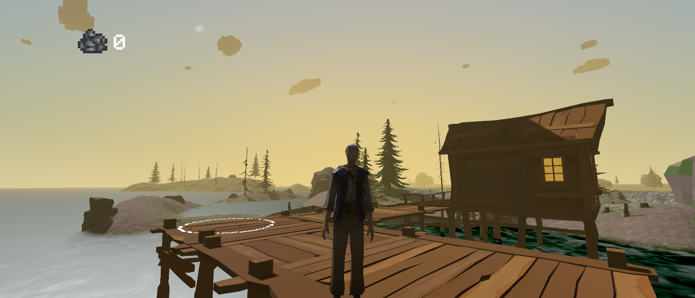

# FECAP - Fundação de Comércio Álvares Penteado

## UnderOcean

## Integrantes: <a href="https://github.com/IsraelRibeiro05">Israel Ribeiro Ramos</a>, <a href="https://github.com/GustavoDinizFroes">Gustavo Diniz Froes</a>, <a href="https://github.com/ArthurRFerr">Arthur Rodrigues Ferreira</a>, <a href="https://github.com/saulosw">Saulo Pereira de Jesus</a>

## Professores Orientadores: <a href="https://www.linkedin.com/in/victorbarq/">Victor Bruno Alexander Rosetti de Quiroz</a>, <a href=" ">Fabiano Alves Onça</a> 

## Descrição

 

## Introdução
UnderOcean é um projeto de jogo Unity desenvolvido por uma equipe de quatro alunos da FECAP (Fundação Escola de Comércio Álvares Penteado). O jogo tem como objetivo conscientizar sobre a importância da preservação da vida marinha, alinhado ao Objetivo de Desenvolvimento Sustentável (ODS) 14: Vida Abaixo da Água.

Em UnderOcean, os jogadores embarcam em uma aventura subaquática para proteger os ecossistemas marinhos de várias ameaças. Através de jogabilidade envolvente e conteúdo educativo

## Feedback
Valorizamos o seu feedback! Se você tiver sugestões, relatórios de bugs ou perguntas sobre o UnderOcean, não hesite em dizer.

## 🛠 Instalação
Para jogar UnderOcean, siga estes passos:
Encontre o UnderOcean_.exe na pasta executável e execute-o.

## 💻 Configuração para Desenvolvimento
Para abrir este projeto, você necessita apenas da pasta de executável

## 📋 Licença/License

<a property="dct:title" rel="cc:attributionURL" href="https://github.com/2024-1-MCC1/Projeto10">UnderOcean</a> by FECAP, Israel Ribeiro Ramos, Gustavo Diniz Froes, Arthur Rodrigues Ferreira, Saulo Pereira de Jesus is licensed under <a href="https://creativecommons.org/licenses/by/4.0/?ref=chooser-v1" target="_blank" rel="license noopener noreferrer" style="display:inline-block;">Creative Commons Attribution 4.0 International</a>
